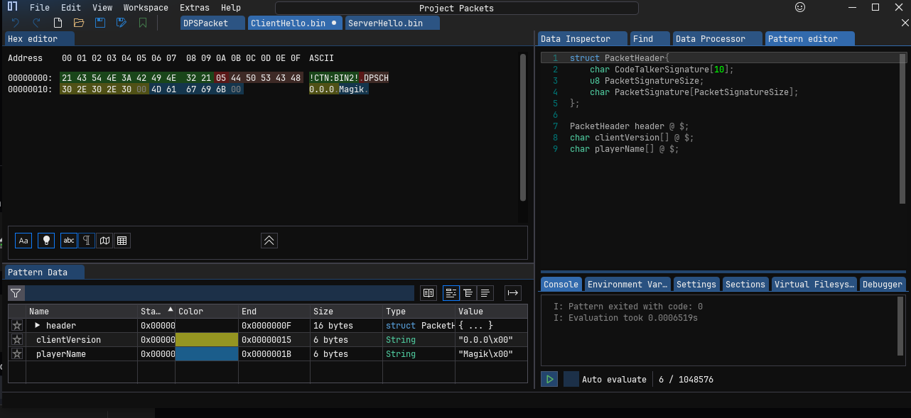

# ImHex Project files

The `.hexproj` is a ImHex project file that opens all of the packets with their pattern data saved

This is useful for debugging packets and it will highlight and name each section of the packet data.

Find the hex debug log from codetalker and copy it into the right packet file. Then on the right go to the pattern editor and click the play button at the bottom right of the pannel. If the pattern editor tab is missing go to View > Pattern Editor and it should show up.

